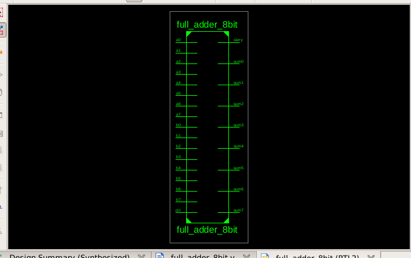
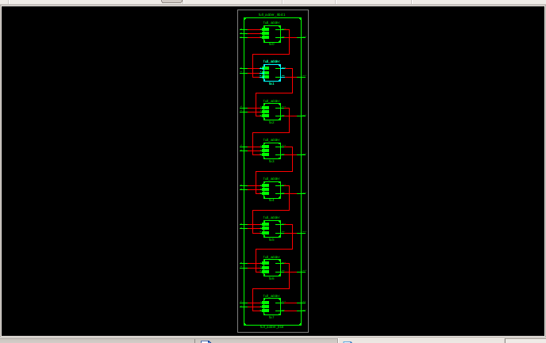
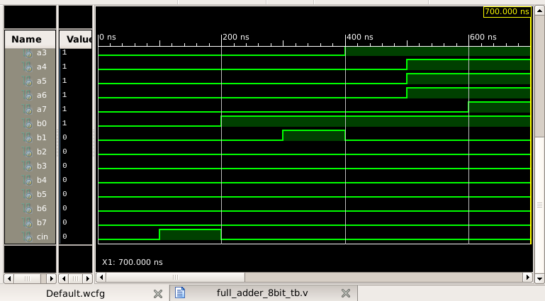
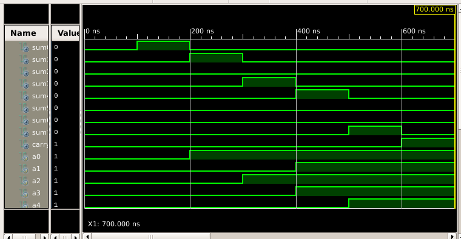

# 8-Bit Full Adder Design and Simulation

This project presents the design and simulation of an **8-bit Full Adder** using **Verilog HDL** in **Xilinx ISE 14.7**.

The 8-bit adder is constructed using eight 1-bit Full Adder stages. The carry output of each stage is connected to the carry input of the next stage, allowing the carry to propagate through the complete 8-bit addition.

---

## Software Used

- Xilinx ISE 14.7
- ISim Simulator
- Verilog HDL

---

## Design Structure

The design contains two 8-bit operands represented by separate input signals:

- `a0` to `a7`
- `b0` to `b7`
- `cin` — initial carry input

The outputs are:

- `sum0` to `sum7`
- `carry` — final carry output

Eight instances of the 1-bit Full Adder module are connected sequentially:

`fa0 → fa1 → fa2 → fa3 → fa4 → fa5 → fa6 → fa7`

The carry generated by one stage is passed to the next stage.

---

## 1-Bit Full Adder Logic

For each Full Adder stage:

**Sum**

`sum = a XOR b XOR cin`

**Carry**

`carry = (a AND b) OR (b AND cin) OR (cin AND a)`

---

## Project Files

| File | Description |
|---|---|
| `full_adder.v` | Verilog implementation of the 1-bit Full Adder |
| `full_adder_8bit.v` | Main 8-bit Full Adder design |
| `full_adder_8bit_tb.v` | Testbench used to verify the 8-bit Full Adder |
| `rtl_schematic_8bit_top_level.png` | Top-level RTL schematic |
| `rtl_schematic_8bit_expanded.png` | Expanded RTL schematic showing the Full Adder stages |
| `simulation_waveform_selected_inputs_8bit.png` | Simulation waveform showing selected input signals |
| `simulation_waveform_output_verification_8bit.png` | Simulation waveform showing the outputs with selected input signals |

---

## RTL Schematic

### Top-Level RTL Schematic

The top-level RTL schematic shows the separate input signals, eight sum outputs, and the final carry output of the 8-bit Full Adder.

### Expanded RTL Schematic

The expanded RTL schematic shows the eight 1-bit Full Adder stages connected in sequence. The carry output from each stage is forwarded to the next stage.

---

## Simulation and Verification

The design was tested in ISim using several binary addition cases. Each test case was applied for **100 ns**.

| Test | Addition | Expected Result |
|---|---|---|
| 1 | 0 + 0 | Sum = 0, Carry = 0 |
| 2 | 0 + 0 + Cin(1) | Sum = 1, Carry = 0 |
| 3 | 1 + 1 | Sum = 2, Carry = 0 |
| 4 | 5 + 3 | Sum = 8, Carry = 0 |
| 5 | 15 + 1 | Sum = 16, Carry = 0 |
| 6 | 127 + 1 | Sum = 128, Carry = 0 |
| 7 | 255 + 1 | Sum = 0, Carry = 1 |

### Selected Input Waveforms

The following waveform shows selected input signals used during the simulation.

### Output Verification Waveforms

The following waveform shows `sum0` to `sum7` and the final `carry` output together with selected input signals.

---

## Result

The 8-bit Full Adder was successfully designed, synthesized, and simulated in Xilinx ISE 14.7. The RTL schematic confirmed the connection of eight 1-bit Full Adder stages, and the simulation results matched the expected binary addition results for all tested cases.

The final carry condition was also verified using the test case **255 + 1 = 256**, where all sum outputs became `0` and the final `carry` became `1`.
